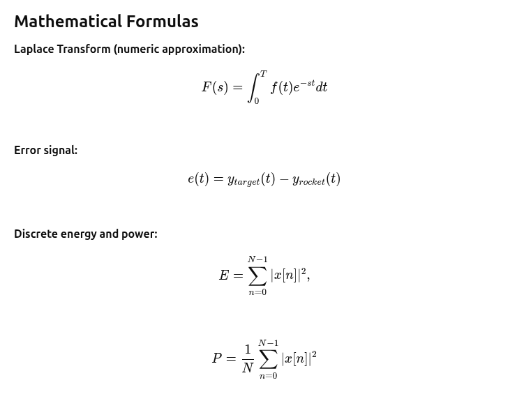
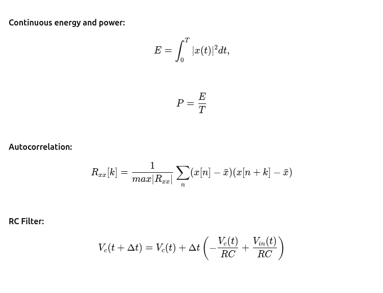

# Rocket Signals Simulation

**Author:** Adrian Szklarski  
**Version:** 1.0  
**Language:** Python 3  
**Dependencies:** see `requirements.txt`

---

## Description

This project simulates a hypersonic interceptor rocket targeting an incoming missile. The simulation includes:
- Real-time animation of the rocket and target.
- Trajectory tracking of both rocket and target.
- Windowed analysis using FFT, autocorrelation, RC filter response.
- Numeric Laplace transform of target, rocket, and control error signals.

The main purpose is educational and for signal analysis and control visualization.

---

## Features

- Rocket dynamics in 2D space.
- Target movement with adjustable velocities.
- Control error calculation: `error_y = target_y - rocket_y`.
- Real-time plotting:
  - Rocket vs Target trajectory.
  - FFT (Fast Fourier Transform) windowed.
  - Autocorrelation of windowed signal.
  - RC filter simulation.
  - Laplace transform of target, rocket, and error signals.
- CSV logging of simulation data.
- Optional MP4 animation export (requires `ffmpeg`).

---

## Requirements

```text
numpy
matplotlib
```

(install with `pip install -r requirements.txt`)

---

## Usage

Run the simulation script with optional parameters:

```bash
python simulation_with_turning_target.py [--duration 30.0] [--dt 0.02] [--speed 6.0] [--kp 0.12] [--target_vx 4.0] [--target_vy 0.9] [--csv] [--mp4]
```

### Arguments:
- `--duration` : Simulation duration in seconds (default 30.0)
- `--dt` : Time step for animation (default 0.02 s)
- `--speed` : Rocket speed in km/s (default 6.0)
- `--kp` : P-controller gain (default 0.12)
- `--target_vx` : Target speed X-axis (default 4.0 km/s)
- `--target_vy` : Target speed Y-axis (default 0.9 km/s)
- `--csv` : Save simulation data to `simulation_log.csv`
- `--mp4` : Export animation to `animation_output.mp4` (requires ffmpeg)

---

## Mathematical Formulas

## Sample Figures from the Simulation





---

## File Structure

```
Missile/
│
├─ simulation_with_turning_target.py  # Main simulation script
├─ module/
│   ├─ __init__.py
│   └─ Math_Laplace.py               # Laplace numeric functions
├─ requirements.txt
├─ README.md
└─ laplace_test.png                  # Sample plot
```

---

## License

MIT License  
Free for educational and research purposes.
